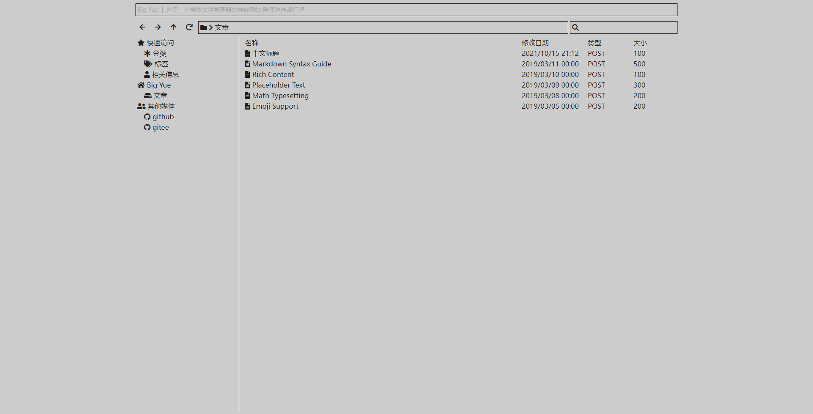
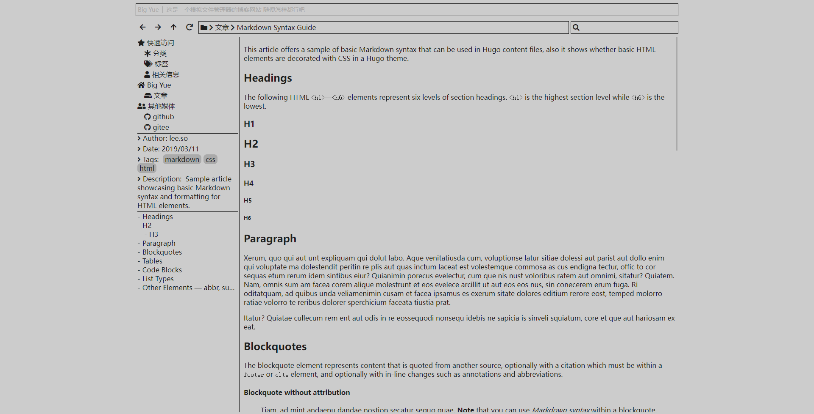

## Hero | A simple Hugo theme

> **H**ugo **E**xplorer **R**ead**O**nly 

This project mainly wants to make a file manager stlye's blog website. 

---

**SectionPage**



**PostPage**



---

### Features

- A File Manager Style's section page
- Breadcrumb Navigation
- Using Font Awesome 5 for icons
- Using Hugo's `json` output format for Search In All regular pages
- Using Katex for math render
- No implemented markdown theme and toc theme
- No suitable for mobile or any device has a narrow width

### Example `config.toml`

```toml
baseURL = 'http://example.org/'
languageCode = 'zh-cn'
theme = 'hero'

[params]
    title = 'Big Yue'
    author = 'bigyue'
    description = '这是一个模拟文件管理器的博客网站 随便怎样都行吧'

[outputs]
    home = ['HTML', 'JSON'] # index.json is used for search

[[menu.main]]
    name = '标签'
    pre = "<i class='fas fa-tags'></i>"
    url = '/tags/'

[[menu.main]]
    name = '分类'
    pre = "<i class='fas fa-asterisk'></i>"
    url = '/categories/'

[[menu.main]]
    name = '相关信息'
    pre = "<i class='fas fa-user'></i>"
    url = '/about/'

[[params.socials]]
    name = 'github'
    pre = "<i class='fab fa-github'></i>"
    url = 'https://github.com/yue1124'

[[params.socials]]
    name = 'gitee'
    pre = "<i class='fab fa-github'></i>"
    url = 'https://gitee.com/bigyue'
```

### **Note**

- Font Awesome and Katex was loaded through jsdelivr. Maybe you want to serve it by yourself, you can direct change the `layouts/partials/head.html`. I would make it a option in `config.toml` in the future.

- There is a lot of things should be changed in a suitable way, all advice will be appreciate (including my poor English).